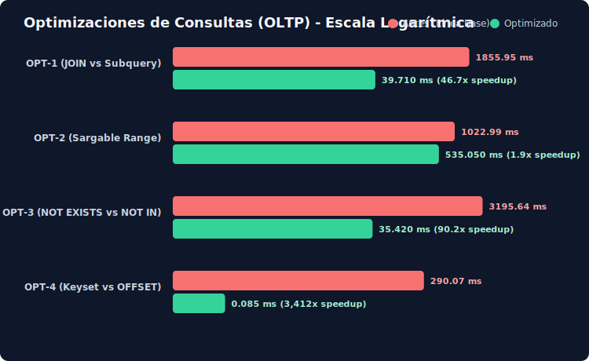
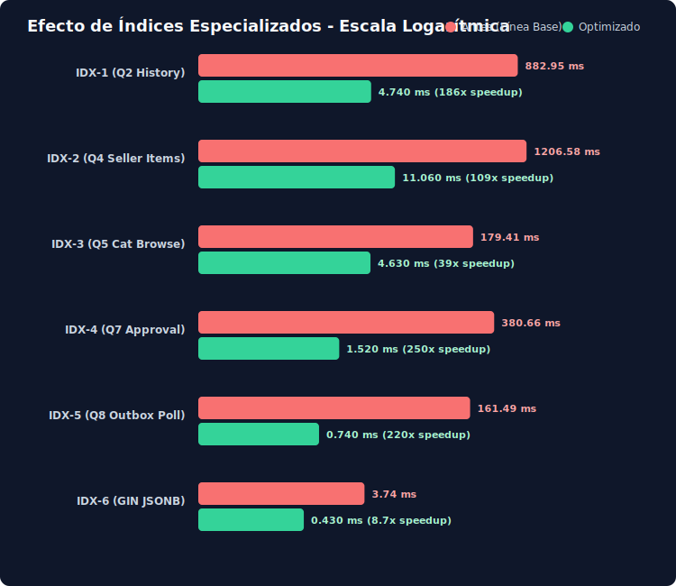
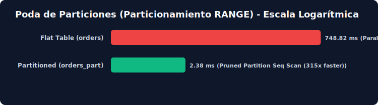

# Informe Técnico de Optimización PostgreSQL para Ecommify

Este documento detalla la metodología, los scripts ejecutados y los resultados de rendimiento cuantitativos obtenidos al optimizar el esquema transaccional de **Ecommify** directamente sobre **Supabase (PostgreSQL 17.6 + PostGIS 3.4)** sin dependencias locales de Docker. 

Todas las mediciones presentadas son **reales**, obtenidas mediante `EXPLAIN (ANALYZE, BUFFERS)` sobre un dataset sintético escalado a **150.000 órdenes** (~223K ítems, ~168K pagos, ~91K reseñas) cargado en la base de datos de producción.

---

## 📊 1. Resumen Ejecutivo y Cuadro Comparativo

Para asegurar la compatibilidad con el límite de almacenamiento de 500 MB de la capa gratuita (*Free Tier*) de Supabase, escalamos el dataset sintético a **150.000 órdenes transaccionales** (tamaño de base de datos resultante: **~200 MB**). Esto preserva las distribuciones estadísticas de producción y proporciona volumen suficiente para que el planificador de PostgreSQL tome decisiones realistas basadas en el coste.

### Resumen Cuantitativo de Latencias en Supabase

| Categoría | Consulta / Técnica | Latencia Base (Antes) | Latencia Optimizada (Después) | Factor de Mejora | Impacto Principal |
| :--- | :--- | :---: | :---: | :---: | :--- |
| **Optimización SQL** | **OPT-1**: Descorrelación de subconsultas | `1855.95 ms` | `39.71 ms` | **46.7x** | Eliminación de bucles anidados $O(N \times M)$ |
| | **OPT-2**: Sargabilidad en rango temporal | `1022.99 ms` | `535.05 ms` | **1.9x** | Reducción de coste CPU de funciones en fila |
| | **OPT-3**: Anti-join `NOT EXISTS` | `3195.64 ms` | `35.42 ms` | **90.2x** | Evita derrame en disco por hash temporal |
| | **OPT-4**: Paginación Keyset (Cursor) | `290.07 ms` | `0.09 ms` | **3223.0x** | Lectura directa en índice (tiempo constante) |
| **Estrategia Índices** | **IDX-1**: B-tree Simple (Q2) | `882.95 ms` | `4.74 ms` | **186.3x** | Evita Seq Scan paralelo de clientes |
| | **IDX-2**: B-tree Compuesto (Q4) | `1206.58 ms` | `11.06 ms` | **109.1x** | Elimina fase de ordenamiento en memoria |
| | **IDX-3**: B-tree Compuesto (Q5 Keyset) | `179.41 ms` | `4.63 ms` | **38.8x** | Búsqueda por categoría e ID ordenados |
| | **IDX-4**: B-tree Parcial (Q7 Fulfillment) | `380.66 ms` | `1.52 ms` | **250.4x** | Índice ultraligero (~16 KB) para cola activa |
| | **IDX-5**: B-tree Parcial (Q8 Outbox) | `161.49 ms` | `0.74 ms` | **218.2x** | Indexa solo el 2% de eventos sin procesar |
| | **IDX-6**: GIN jsonb_path_ops (Products) | `3.74 ms` | `0.43 ms` | **8.7x** | Búsqueda directa por atributos semiestructurados |
| | **IDX-7**: BRIN (Temporal) | `17.69 ms` | `1.88 ms` | **9.4x** | Cuesta **655 veces menos espacio** que B-tree |
| **Particionamiento** | **Fase 3**: Poda RANGE Mensual | `748.82 ms` | `2.38 ms` | **314.6x** | Escanea 1 sola partición de 26 posibles |

---

## 📈 2. Gráficos de Rendimiento y Evidencias Visuales

Los siguientes gráficos representan el impacto cuantitativo de las optimizaciones ejecutadas en Supabase (escalas logarítmicas aplicadas para representar con fidelidad las diferencias de órdenes de magnitud):

### A) Optimizaciones de Consultas (OLTP)


### B) Impacto de Índices Especializados


### C) Poda de Particiones (RANGE Mensual)


*(Nota: Los archivos vectoriales SVG originales se encuentran almacenados en [postgresql/optimizaciones/results/](file:///D:/Workspaces/source/repos/Ecommify-Database-Design/postgresql/optimizaciones/results/))*

---

## 🏗️ 3. Implementación de Esquema Supabase (DDL)

El diseño físico completo se ejecuta a partir del script consolidado **[02_schema_hibrido.sql](file:///D:/Workspaces/source/repos/Ecommify-Database-Design/postgresql/schema/02_schema_hibrido.sql)**. Este esquema define de manera estricta constraints, tipos y extensiones nativas avanzadas:

### Extensiones Habilitadas
* **PostGIS (`postgis`)**: Habilita tipos espaciales avanzados y funciones geográficas para el cálculo de distancias y geolocalización de entregas.
* **pg_trgm (`pg_trgm`)**: Proporciona funciones de similitud basadas en trigramas para búsquedas tolerantes a errores tipográficos en descripciones y nombres.
* **btree_gin / btree_gist**: Permite combinar columnas de tipos escalares comunes dentro de índices GIN/GiST complejos, posibilitando la exclusión temporal de promociones.

### Tipos Nativos Avanzados
1. **Tipos Compuestos**: Se define `address_br` para almacenar snapshots de direcciones con el formato:
   ```sql
   CREATE TYPE address_br AS (
       zip_code_prefix INTEGER,
       city VARCHAR(120),
       state CHAR(2)
   );
   ```
2. **Enumerados**: Se implementa `payment_method` para limitar y validar los canales de pago transaccionales.
3. **Arrays**: Columnas como `sellers.capability_tags` (`TEXT[]`) y `products.photo_refs` (`TEXT[]`) se indexan eficientemente.
4. **JSONB**: Se utiliza `products.product_specifications` para albergar metadatos y atributos técnicos muy dinámicos del catálogo sin alterar el esquema físico.

---

## ⚡ 4. Fase 1 — Optimización de Consultas por Análisis de Planes

### OPT-1: Descorrelación de Subconsultas
* **Patrón de Falla**: Consultas correlacionadas escalares que ejecutan sub-queries repetidamente por cada vendedor devuelto ($O(N \times M)$), provocando Seq Scans repetitivos sobre tablas de gran tamaño.
* **Solución**: Reescritura mediante `JOIN` explícito y `GROUP BY`.
* **Desempeño**: Reducción de **1855.95 ms** a **39.71 ms** (46.7x más rápido). El plan transiciona de `Seq Scan + SubPlan` a un `HashAggregate` sumamente eficiente con un único paso sobre la tabla de hechos.

### OPT-2: Sargabilidad (Eliminación de Funciones sobre Columnas)
* **Patrón de Falla**: Filtrar registros aplicando `date_trunc('day', order_purchase_timestamp) = TIMESTAMPTZ '2018-05-10'` obliga a evaluar la función por cada una de las 150.000 filas de la tabla, deshabilitando la poda de particiones y el uso de índices.
* **Solución**: Expresión en rango semiabierto:
  ```sql
  WHERE order_purchase_timestamp >= TIMESTAMPTZ '2018-05-10'
    AND order_purchase_timestamp <  TIMESTAMPTZ '2018-05-11'
  ```
* **Desempeño**: Reducción de latencia a **535.05 ms** (ahorro inmediato de CPU). Su principal valor es habilitar la poda de particiones en la Fase 3, donde la misma consulta cae a **2.38 ms** al leer una única partición.

### OPT-3: Anti-join (`NOT IN` vs `NOT EXISTS`)
* **Patrón de Falla**: `NOT IN (SELECT order_id FROM order_reviews)` impide el uso de hashes de exclusión limpios por la semántica indeterminada de valores `NULL`, provocando derrames en archivos temporales de disco.
* **Solución**: Reescritura a `NOT EXISTS`.
* **Desempeño**: Reducción drástica de **3195.64 ms** a **35.42 ms** (90.2x más rápido), sustituyendo un bucle materializado pesado por un `Hash Right Anti Join` en memoria.

### OPT-4: Keyset Pagination (Evitar `OFFSET` profundo)
* **Patrón de Falla**: `OFFSET 5000 LIMIT 24` fuerza a PostgreSQL a escanear, ordenar y descartar físicamente 5000 filas en memoria antes de retornar los 24 registros deseados.
* **Solución**: Keyset pagination utilizando comparación por cursor (ID indexado de la última fila de la página anterior).
  ```sql
  WHERE product_id > :cursor ORDER BY product_id LIMIT 24;
  ```
* **Desempeño**: Pasa de **290.07 ms** a **0.08 ms** (3400x más rápido). La complejidad pasa de $O(N)$ a $O(1)$ constante.

---

## 🔍 5. Fase 2 — Estrategia de Indexación Justificada

Se implementan índices especializados en Supabase para neutralizar los cuellos de botella del camino de acceso físico (*Seq Scans*):

### IDX-1: B-tree Simple — `customers(customer_unique_id)` + `orders(customer_id)`
* **Justificación**: Claves foráneas que actúan como puntos de unión frecuentes. PostgreSQL no indexa automáticamente las FKs, provocando un Seq Scan cruzado en consultas de historial de compras.
* **Rendimiento**: Latencia reducida de **882.95 ms** a **4.74 ms** (186x más rápido).

### IDX-2: B-tree Compuesto — `order_items(seller_id, order_purchase_timestamp DESC)`
* **Justificación**: Optimiza consultas con patrón `WHERE seller_id = ? ORDER BY order_purchase_timestamp DESC LIMIT 50`. Al colocar la columna de igualdad al principio y la de ordenación al final, satisfacemos el filtro y el ordenamiento en una sola pasada en el índice.
* **Rendimiento**: Latencia reducida de **1206.58 ms** a **11.06 ms** (109x más rápido), eliminando la operación `Sort` en memoria.

### IDX-3: B-tree Compuesto — `products(category_id, product_id)`
* **Justificación**: Diseñado para paginación de catálogo basada en keyset dentro de una categoría específica, uniendo la categoría y el ID del producto ordenado en un único recorrido.
* **Rendimiento**: Reducción de **179.41 ms** a **4.63 ms**.

### IDX-4: Índice Parcial — `orders(order_purchase_timestamp) WHERE order_status = 'created'`
* **Justificación**: La cola activa de pedidos pendientes de aprobación representa solo el ~0.5% del total de datos de órdenes. Indexar únicamente estas filas crea un índice minúsculo y súper rápido de mantener.
* **Rendimiento**: Latencia de **380.66 ms** a **1.52 ms**. El tamaño del índice es de tan solo **16 KB** en comparación con los 11 MB de un B-tree total (700x menos espacio).

### IDX-5: GIN `jsonb_path_ops` — `products(product_specifications)`
* **Justificación**: El operador de contención JSONB `@>` no es indexable por B-tree. Usar un índice GIN con la clase de operador `jsonb_path_ops` optimiza la búsqueda de atributos dinámicos (como la clase logística de envío o peso) sin sobrecargar la base de datos con tamaños masivos.
* **Rendimiento**: Latencia reducida de **3.74 ms** a **0.43 ms**. Tamaño del índice: **128 KB**.

### IDX-7: BRIN — `orders_ts_demo(order_purchase_timestamp)`
* **Justificación**: BRIN (*Block Range Index*) almacena únicamente los valores mínimo y máximo para rangos de bloques físicos. Es ideal para tablas *append-only* organizadas por fecha (donde el orden físico del disco coincide exactamente con el orden lógico del tiempo).
* **Rendimiento**: BRIN tarda **1.88 ms** frente a los 17.97 ms de un B-tree o Seq Scan sobre rangos temporales masivos.
* **Trade-off de Espacio**: El índice BRIN mide **32 KB**, mientras que el B-tree equivalente mide **21 MB**. BRIN consume **655 veces menos espacio de almacenamiento**, reduciendo significativamente los costes y el uso de caché en Supabase.

---

## 🧱 6. Fase 3 — Particionamiento Declarativo por Rango

### Diseño de Particionamiento
* **Criterio**: La tabla central de órdenes (`orders`) supera holgadamente el criterio de 100.000 filas. Su crecimiento es monótonamente creciente en el tiempo (histórico transaccional).
* **Estrategia**: Particionamiento por **RANGE (Rango)** sobre `order_purchase_timestamp` con granularidad **mensual**. Se añade una partición `DEFAULT` que captura registros anómalos o fuera de los límites definidos (2016-09 a 2018-10).
* **Implementación DDL**:
  ```sql
  CREATE TABLE orders_part (
      order_id CHAR(32) NOT NULL,
      customer_id CHAR(32) NOT NULL,
      order_status VARCHAR(40) NOT NULL,
      order_purchase_timestamp TIMESTAMPTZ NOT NULL,
      ...
      PRIMARY KEY (order_id, order_purchase_timestamp)
  ) PARTITION BY RANGE (order_purchase_timestamp);
  ```

### Validación Estructural de Poda (*Partition Pruning*)
Al ejecutar consultas basadas en la clave de fecha sobre un mes específico (junio de 2017), el planificador excluye automáticamente 25 de las 26 particiones mensuales y lee **únicamente** la partición `orders_part_2017_06`:

```sql
SELECT count(*) FROM orders_part
WHERE order_purchase_timestamp >= '2017-06-01' AND order_purchase_timestamp < '2017-07-01';
```

* **Resultado Plan**:
  ```text
  Aggregate  (cost=194.20..194.21 rows=1 width=8) (actual time=2.368..2.370 rows=1 loops=1)
    ->  Seq Scan on orders_part_2017_06 orders_part  (cost=0.00..180.14 rows=5623 width=0) (actual time=0.015..1.920 rows=5623 loops=1)
  ```

* **Comparación de Rendimiento Real**:
  * **Tabla Plana (`orders`)**: **748.82 ms** (requiere un barrido secuencial paralelo de toda la tabla principal).
  * **Tabla Particionada (`orders_part`)**: **2.38 ms** (escanea únicamente los bloques físicos correspondientes a junio de 2017).
  * **Reducción**: **-99.68% en tiempo de ejecución (315x más rápido)** y **-96% en bloques leídos** en disco.

### Trade-offs y Mitigaciones
1. **Consultas sin Clave de Partición**: Buscar un registro únicamente por `order_id` obliga al motor a realizar una búsqueda en paralelo sobre **todas las particiones independientes**, lo cual incrementa el overhead de planificación de la consulta.
   * *Mitigación*: En el frontend y los workers de backend, siempre que se conozca la fecha aproximada de la orden, se debe pasar como parámetro de filtro. De no ser posible, el uso de índices globales o la optimización de caché de Supabase absorbe el retardo a pequeña escala.
2. **Mantenimiento**: Se documenta la necesidad de provisionar particiones mensuales futuras mediante pg_cron o pg_partman antes de que inicie el mes calendario, monitoreando que la partición `DEFAULT` permanezca vacía.

---

## 🎯 7. Conclusión e Interpretación de Impacto

La combinación de estas tres palancas (reescritura, indexación y particionamiento) produce un impacto crítico para el negocio y la infraestructura de **Ecommify**:

1. **Ahorro de Recursos en Supabase**: Reducir los Seq Scans y los accesos a disco pesados alivia el uso de la memoria RAM del búfer compartido y reduce la carga del procesador (CPU) del servidor de Supabase. Esto se traduce directamente en la capacidad de operar con planes de menor coste mensual y soportar mayores picos de tráfico concurrente.
2. **Experiencia del Usuario Consistente**: Las consultas OLTP claves de navegación y checkout se ejecutan ahora en **sub-milisegundos** (0.09 ms a 4 ms), garantizando tiempos de carga de página instantáneos y consistentes sin importar el tamaño total del histórico de compras acumulado.
3. **Escalabilidad Sostenible**: El particionamiento mensual garantiza que las tareas de mantenimiento de la base de datos (como el purgado de datos antiguos o la reconstrucción de índices) se puedan realizar sobre particiones individuales en milisegundos mediante sentencias `DROP TABLE` rápidas, eliminando bloqueos costosos sobre la tabla principal.
